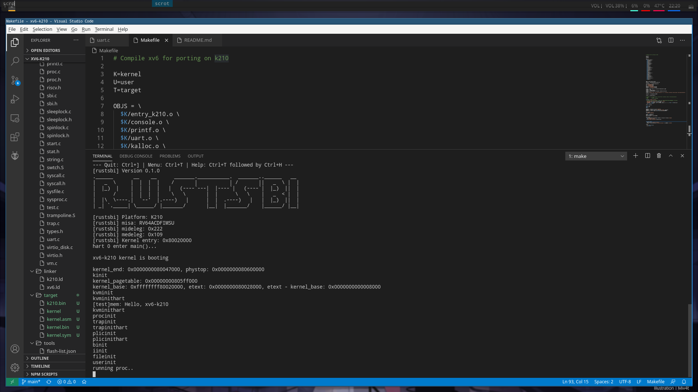

# XV6-RISCV On K210
Run xv6-riscv on k210 board
  

## Dependencies
+ k210 board
+ RISC-V Toolchain

## Installation
```bash
git clone https://github.com/SKTT1Ryze/xv6-k210
```

## Build
First you need to connect your k210 board to your PC.  
And check the USB port:  
```bash
ls /dev/ | grep USB
```
In my situation it will be `ttyUSB0`  

```bash
cd xv6-k210
mkdir target
make build
```

## Run
```bash
make run-k210 k210-serialport=`Your-USB-port`(default by ttyUSB1)
```
Ps: Most of the k210-port in Linux is ttyUSB0, if you use Windows or Mac OS, this doc 
may help you: [maixpy-doc](https://maixpy.sipeed.com/zh/get_started/env_install_driver.html#)  

## Progress
- [x] Multicore boot
- [x] Bare-metal printf
- [x] Memory alloc
- [x] Page Table
- [x] Timer interrupt
- [x] S mode extern interrupt
- [x] Receive uarths message
- [x] SD card driver
- [ ] Process management
- [ ] File system
- [ ] User program

## TODO
The rest part of xv6-kernel and xv6-fs
