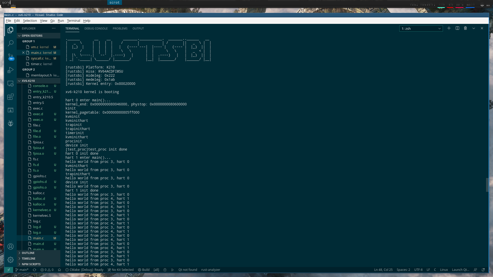

# 用户多进程移植记录

## 前言
在进行进程管理移植工作之前，我们的内核已经完成了 SD 卡驱动的移植，这就意味着我们可以把用户程序打包成文件系统，放到 sdcard 里面去，内核通过 sdcard 驱动将用户程序从 sdcard 读到内存里面运行。这样看起来跑用户多进程应该是顺理成章的事情。但实际上从这步到我们最终成功跑起用户多进程花了大概两周的时间。  
这部分移植工作是我和两个华科 18 级计卓班的同学一起做的，他们做了很多的调试工作。我们遇到一些问题，通过这些问题我们对操作系统特别是 xv6 有了更深的认识。  

## xv6 简单的进程管理
相比于 rCore，xv6 的进程管理是比较简单的，它甚至没有线程的概念，只有进程的概念。下面主要是大致走一下 xv6 的进程管理流程，如果对 xv6 整体代码不熟悉的话可以先去看下 xv6 的源码：[xv6-riscv](https://github.com/mit-pdos/xv6-riscv.git)，或者去看一下 xv6-riscv 的文档。  
xv6 的第一个用户进程在`userinit`中初始化，用`allocproc`来分配一个进程，然后用`uvminit`函数来为用户程序创建一个物理页，并在进程的页表中映射对应虚拟地址和物理地址，然后将用户代码（机器码）放到分配的物理内存中。同时设置`trapframe->epc`为 0x0，后面我们进入到用户态的时候将从`trapframe->epc`中保存的`虚拟地址`（这里是 0x0）开始运行，这个虚拟地址将会通过 k210 的 MMU 转换为物理地址，转换方式是由该进程的页表决定的。  
初始化好了第一个用户进程之后，我们在进程调度器`scheduler`里面进行进程的调度。调度器会获得当前 cpu 核，然后在进程队列里面找状态为 runnable 的进程，找到之后就用`swtch`函数切换上下文，再然后返回到`forkret`函数（在`allocproc`函数里面将进程的`context.ra`设置成了`forkret`函数）。在`forkret`函数里面先判断是不是第一个运行这个用户进程，如果是的话就要进行文件系统的初始化（这部分我们先注释掉不管），然后调用`usertrapret`函数。这个函数里面主要是做进入用户态之前的一些准备工作，比如开中断，设置用户态中断和异常入口等等，具体可以看源码。然后跳转到`userret`函数，这个函数在`trampoline.S`文件里面，`userret`首先会将页表地址放到`satp`寄存器里面，然后执行`sfence.vma`指令清空`TLB`，然后保存进程的上下文到寄存器中，最后执行`sret`指令，就会进入之前设置的`trapframe->epc`地址（这里是 0x0）去运行，注意，这里是虚拟地址，之前已经把用户进程的页表地址放到`satp`寄存器去了，k210 的 MMU 会把这个虚拟地址转换为物理地址，而这个物理地址就是之前`allocproc`中内核分配给用户进程的物理页，里面放着用户程序的机器码。这样 CPU 就会读取这些用户程序机器码去运行。  
而每次时钟中断的时候，内核会调用`yield`函数，然后进行一系列操作进行进程的切换，它会回到`scheduler`中`swtch`的下一行去运行。具体可以u阅读源码。  
xv6 的进程管理大概是这样子，看到这里可能有人把该段标题中的”简单“两字打上引号。但我们需要明白的一点就是：进程管理占 OS 内核的大部分，它涉及特权级的切换，中断和异常的响应，还有虚拟地址空间到物理地址空间的映射，相比于 rCore 或者 Linux 的进程管理，xv6 的已经是非常简单的了。  

## 艰难的调试过程
我们理清了 xv6 进程管理的思路，但这只是纸上谈兵，要想在真实板子上跑起多用户进程，还有路要走。  
首先在上面所说的流程，我们已经走到了最后一步，就是执行`sret`指令，之后它应该会跳转到`sepc`，也就是我们之前设置的`trapframe->epc`中去运行。我们这里设置为 0x0，我们在用户进程页表中把它映射到了一个物理页，这个物理页里面放着我们要运行的机器码，而且我们也已经把这个页表放到了`satp`寄存器去，一切看起来都没什么问题。  
但是`rustsbi`报错：  
```
[rustsbi]invalid instruction! mepc: 0x0000000000000000, instruction: 0x0000000000000000
```
这条报错的意思是：我们想要执行一条指令，这个指令的虚拟地址是 0x000000000000000，而这个虚拟地址里面的内容是 0x0000000000000000。  
我们当时很迷惑，因为这个虚拟地址 0x0 应该会通过我们设置的用户进程页表映射到一个物理地址里面去，这个物理地址会有我们想要的指令，而不是全零。  
我们当时怀疑是之前的哪个步骤出了问题，比如页表映射不对，或者页表没放到`satp`寄存器里面去等等。我们做了很多调试，比如修改`trapframe->epc`的值，还有用`kvmpa`函数看下虚拟地址 0x0 通过页表映射到哪个物理地址了，然后再看分配的物理页中放的机器指令。一切看起来都没问题但是不知道为什么`rustsbi`总会报上面这个错误。  
到后面我们怀疑 k210 没开启分页机制。  

## 雨
我们怀疑 k210 没开启分页机制，才会导致上述的错误。因为内核的映射都是直接映射，没什么影响，但一旦到了用户态，问题就出来了。但即使知道这个问题，我们很难知道我们是否开启了分页，因为我们的内核甚至一些调试工具，都只能看到虚拟地址，物理内存里面的东西对于我们来说是透明的。  
对于这个困境，我想我们必须要有一些调试工具来帮我们调试内核了，我希望可以加断点单步调试，还能打印寄存器信息，查看堆栈和内存数据。  
但是这个调试环境的配置花了我很大的功夫。我使用 kendryte-openocd 和 spieed 官方的 rv debugger lite，按照官方调试文档上去做，但 openocd 一直连不上我的 k210 板子。没办法，我只好去淘宝网购官方的 rv jtag 调试器。在调试器没到这段时间，我们的移植进展几乎为零。  
调试器到了，我以为能够改善一下调试环境了（之前都是在内核里面打 log），但即使我能够使用 openocd 连接上我的 k210 板子，并且用 gdb 连接上它，我还是没法加断点。因为 gdb 无法找到烧到 k210 SRAM 里面的符号信息。或许是因为我不熟悉 jtag 调试而找不到正确的调试方法，如果我花点时间在这个调试环境的配置上面这个问题i就能解决。为了解决这个问题我还专门去找了我实验室的李博士咨询关于 jtag 调试的问题，但最终还是徒劳。  
考试周的临近和准备 N2 考试的压力使我感到焦躁，我有一段时间处于迷惘状态，心里像是下着大雨一样压抑。  

## 彩虹
我的冥思苦想终于还是有了结果。在一个周一的早上，我找到了问题所在。没有任何契机，大概是我那段时间的调试过程和翻阅大量资料还有和同学们的沟通的结果，一个解决问题的想法就那样悄无声息地飘过我的脑海。  
下面我直接说明错误的来源和处理这个错误的方案：  
首先 k210 的 riscv 指令集是 1.9.1 版本，和现在的 riscv 指令集版本（1.11）会有一定的区别，具体请看 luojia 的 rustsbi 里面的文档：[rustsbi-k210](https://github.com/luojia65/rustsbi/tree/master/platform/k210)  
这里说一下会涉及到的区别：  
+ 1.9.1 版本的清空 TLB 的指令是 sfence.vm，而现在 riscv 指令集用的指令是 sfence.vma
+ 1.9.1 版本的放页表首地址的寄存器是 sptbr，而现在 riscv 指令集用的存放页表首地址的寄存器是 satp
+ 1.9.1 版本的指令集中如果要开启分页机制的话需要设置 mstatus.vm 位，而这个位在当前指令集的 mstatus 中已经没有了

再来梳理一下为什么我们之前分页好像没有打开：我们每次设置页表的时候，我们是将页表的首地址放到 satp 寄存器里面，然后执行 sfence.vm 指令。问题来了，我们没有设置 mstatus.vm 位，这是没有开启分页的理由的可能性很高。我们的内核运行在 S 态，我们不可能在内核里面设置 mstatus.vm 位，那么该怎么办。M 态自然会想到 rustsbi，rustsbi 什么时候设置 mstatus.vm 位？执行 sfence.vma 指令的时候。  
这样一来就很明朗了，因为我们清空 TLB 用的是旧版指令 sfence.vm，因此 rustsbi 不会帮我们设置 mstatus.vm 位，这样一来分页就没有打开。  
那为什么我们不使用 sfence.vma 指令呢，之前我是尝试用过这条指令来清 TLB 的，但是运行这条指令后内核后面就会“卡住”（当然 riscv 中不存在卡住这情况，要么是异常要么是中断要么是陷入死循环），现在看来这个卡住正好证明了执行 sfence.vma 后分页是打开的，为什么呢？因为我们的页表映射是错的，我们把错的页表写入了 satp 寄存器，然后执行 sfence.vma 这条指令，rustsbi 捕捉到这条非法指令（k210 中不存在这条 指令），然后进行一系列的处理工作，其中包括了把页表首地址写入 sptbr 寄存器和设置 mstatus.vm 位，然后返回到 mepc + 4 的地址去，问题在这里，在返回之前分页已经打开了，因此 mepc + 4 是虚拟地址，如果页表是错的，那么我们返回的地址就会映射到一个奇怪的物理地址，我们不应该返回到这里，因此会出现“卡住”这种现象。  
这下找到原因了：我们应该使用 sfence.vma 指令而不是 sfence.vm，并且我们需要一个正确的内核页表。  
我们为何页表映射是错的呢，其实我当时移植 vm 这块的时候并不是很清楚整个内核的内存布局是怎么样的，当时在不清楚想要如何映射内存的情况下瞎搞，觉得能跑就行，没有深入研究，导致现在的地址映射十分糟糕。  
如何修改呢，经过一些考虑，我决定采用以下方案：  
首先我们的内核在 k210 中的起始物理地址是 0x80020000，这个必须得清楚。  
然后我决定将 k210.ld 中的 kernel_base 改为 0x80020000，而不是 0xffffffff80020000，之前我尝试改过，但是会有编译错误，现在我想彻底解决这个问题。  
如果编译通过之后，我们将会在 vm.c 和 kalloc.c 文件里面修改相应的地址逻辑，让内核按照我们想要的方式进行内存分配和地址映射，而不是想之前那样瞎搞。  
我当天晚上把我的发现和计卓班的两个同学交流，当晚就开始修改这个错误。  
然后第二天晚上，用户多进程跑通了。我们改了 k210.ld 中的 kernel_base，设置了一个正确的内核页表，另外还修改了一些会产生错误的地方，设置了一个不断进行系统调用的用户进程，最终我们看到用户进程成功在 k210 中跑起来了，多个进程在不断调用我们添加的打印“hello,world”的系统调用，并且在每次时钟中断的时候切换进程。甚至是 k210 上的双核在不断取进程队列中的用户进程来运行。  
一切都好起来了～  

## 一个月的成果
xv6-k210 这个项目 2020 年 10 月 18 号开始创建，到今天 11 月 18 号，恰好一个月的时间，这个月时间里我就像在打副本，遇到一个又一个难关，一次次地突破，到现在，终于有所成果，可以拿出一个 demo 跑给老师和同学们看了。  
  

## 尾声
虽然上面成功跑起了用户多进程，但是内核还剩下一些问题需要解决。比如成功跑通多进程的那天晚上 SD 卡驱动用不了，还有 S 态外部中断之前是解决了的，现在好像又出现 bug 了。  
我利用一次计网实验课和一次操作系统实验课解决了 SD 卡驱动无法使用的 bug，问题主要是因为我们现在分页机制打开了，就需要在内核页表中把一些外设的寄存器在内存中的地址（MMIO）添加映射关系，不然会发生 StoreFault 和 LoadFault 错误。我根据 luojia 逆向出来的 k210 外设寄存器地址，给它们建立直接映射的关系，这样一来 SD 卡驱动就修复好了。  
S 态外部中断现在会引发 rustsbi panic，还没解决，这个留着我后面考完试再来慢慢修复。  
文件系统也先放着吧，反正 SD 卡驱动好了，文件系统应该会比较顺利。  
作者邮箱：linuxgnulover@gmail.com  

## 鸣谢
+ retrhelo
+ luojia65
+ wyfcyx