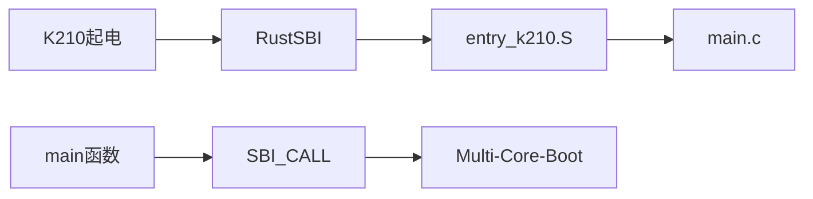

# **xv6-k210 移植报告**
+ 报告人： 车春池
+ 时间： 2020-12-26  
+ 地点： 北京中科院计算所

---
## 前言

+ `xv6` 和 `xv6-riscv`，`MIT` 教学操作系统
+ `xv6` 官方只支持 `qemu` 平台
+ `k210`：两个 `RISC-V` 核的芯片
+ `RustSBI`：为移植工作提供很大帮助

---
## 当前成果

---
## 运行流程
+ `RISC-V` 编译链，可以是 `riscv64-unknown-elf` 或者 `riscv64-linux-gnu`
+ 搭载 `k210` 芯片的开发板： `Maixpy` 系列
+ SD 卡：可选，如果不跑文件系统的话
+ 获得项目源码： `git clone https://github.com/SKTT1Ryze/xv6-k210`
+ 用读卡器把 SD 卡连接到电脑
+ 进入到 `xv6-k210` 目录下运行命令 `make sdcard`，然后 `Makefile` 会打包一个文件系统镜像写入到 SD 卡
+ 将 SD 卡插到 `k210` 板子上，并用 type-C 线连接 `k210` 板子到电脑上
+ 在 `xv6-k210` 目录下运行命令 `make run`
+ 查看 `USB` 端口： `ls /dev/ | grep USB`

---
## K210
+ 两个核心，双核对等，具备独立 FPU
+ 64 位处理核
+ 标称频率为 400MHZ
+ 双精度浮点处理单元
+ PLIC 支持高级中断管理
+ CLINT 支持 CPU 内置定时器中断与跨核心中断
+ 8M 的片上 SRAM

---
## K210 SRAM
|模块名称|映射类型|开始地址|结束地址|空间大小|
|---|---|---|---|---|
|通用 SRAM 存储器|经 CPU 缓存|0x80000000|0x805FFFFF|0x600000|
|AI SRAM 存储器|经 CPU 缓存|0x80600000|0x807FFFFF|0x200000|
|通用 SRAM 存储器|非 CPU 缓存|0x40000000|0x405FFFFF|0x6000000|
|AI SRAM 存储器|非 CPU 缓存|0x40600000|0x407FFFFF|0x200000|

---
## K210 VS QEMU
+ 指令集标准不同
+ 内存布局不同
+ 虚拟文件系统 vs SD 卡上的文件系统

---
## RustSBI
+ 脱胎于 2020 年暑假鹏城实验室的“rCore代码之夏”活动
+ 操作系统二进制接口（SBI）的一种实现
+ Rust 语言编写
+ 模块化设计，方便支持新的平台

---
## 多核启动
+ 链接脚本 k210.ld：调整内核镜像布局和指定内核入口点
+ `RustSBI` 将处理器核从 `M` 态切换到 `S` 态，然后跳转到内核起始地址
+ entry_k210.S：操作系统内核运行的第一段代码
+ `mani.c`：进入 `supervisor` 模式
+ `RustSBI` 提供接口，使得可以在启动的第 0 个核中唤醒其他核

---
## 多核启动

---
## 内存分配
+ `kalloc.c`
+ `kernel_end` ~ `PHYSOP`
+ void kinit()
+ void* kalloc()：4096 字节
+ 内核维护一个链表

---
## 虚拟内存管理
+ `vm.c`
+ 在 void kvminit() 里面进行虚拟地址到物理地址的映射
+ MMIO，内核空间，用户态空间， RustSBI
+ 在 void kvminithart() 里面将内核页表的首地址放到 `satp` 寄存器，然后运行 `sfence.vma` 指令

---
## 虚拟内存管理
**重点！！ K210 采用的是 1.9 版本的 RISC-V 标准，不存在 sfence.vma 这条指令，只有旧版指令 sfence.vm**  
怎么办？求助 `RustSBI`

---
## 虚拟内存管理
**RustSBI 如何解决这个问题？**  
+ `sfence.vma` 作为异常指令被 `RustSBI` 捕获
+ 读取 `satp`（读取 `ppn`）
+ 写 `sptbr` 设置页表
+ 设置 `mstatus` 开启分页（内核无法做这个工作）
+ 运行旧版指令 `sfence.vm` 清空 `TLB`
+ 写 `mepc` 并返回到 `sfence.vma` 的下一条指令去运行

---
## 虚拟内存管理
内存映射图：  

---
## 中断处理
+ `trap.c`
+ void kerneltrap()
+ void usertrap()
+ int devintr()

---
## 中断处理
中断处理初始化工作：  
+ 将 `kernelvec` 地址写入到 `stvec`
+ 设置 `sstatus.sie` 位
+ 设置 `sie` 开启外部中断，时钟中断和软件中断

---
## 时钟中断
**通过 RustSBI 设置时钟中断**
+ `timer.c` 
+ void set_next_timeout()：设置下一次时钟中断的时间
+ void timerinit()：初始化时钟中断
+ void timer_tick()：触发时钟中断的时候进入这里，这里也会设置下一次时钟中断
+ 神奇的 bug：set_next_timeout 中的 printf("");

---
## S 态外部中断
为什么需要移植 S 态外部中断？  
**想要使用 S 态众多的数据结构来对外部中断进行处理**  
移植 S 态外部中断遇到的问题：`k210` 上没有 S 态外部中断！  
怎么办？  
**求助 RustSBI**  

---
## S 态外部中断
**RustSBI 使用黑科技解决 K210 上 S 态外部中断**
感谢吴一凡学长移植 `rCore` 到 `k210` 上的文档和洛佳同学的解惑。  
+ `RustSBI` 提供一个接口 `void SBI_CALL_1(0x09, func_pointer)`
+ S 态外部中断处理函数 `supervisor_external_handler`
+ 将这个函数指针作为参数调用 `RustSBI` 提供的接口
+ 外部中断将会在 `supervisor_external_handler` 中处理

---
## 用户多进程
+ `proc.c` & `trap.c` & `trampoline.S` & `swtch.S`
+ void proc_init()：初始化进程队列
+ void userinit()：初始化第一个用户进程
+ void scheduler()：进行进程调度
+ void swtch(struct context*, struct context*)：上下文切换
+ void forkret()
+ void usertrapret()
+ `trampoline.S` 里面的 `userret`
+ 时钟中断的时候会调用 `swtch`

---
## 用户多进程
流程图：  

---
## SD 卡驱动
+ `sdcard.c`
+ 官方 SDK
+ 暴力出奇迹

---
## 文件系统

---
## 软硬协同调试
+ `Makefile` + 条件编译
+ 类似于封装硬件抽象层
+ 软件调试，一键部署

---
## 中文文档
+ 移植文档
+ `xv6-riscv` 原理文档

---