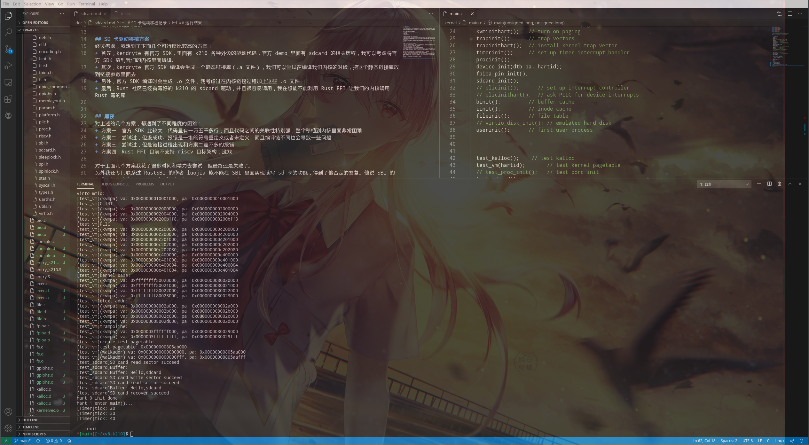

# SD 卡驱动移植记录

## 为什么需要 SD 卡驱动
在 k210 板子上移植 xv6，我们希望做到这样一种模式：把 OS 内核和 RustSBI 直接烧到 k210 的 SRAM 里面去，而对于用户程序，我们希望把它们打包成文件系统，然后用 dd 命令烧到 sd 卡里面去，这里的 sd 卡就相当于硬盘。那么如何去运行用户程序呢，首先要解决的问题就是如何从我们的内核里面读取 sd 卡数据，这样一来，sd 卡驱动的必要性就显现出来了。  

## 困难
移植 SD 卡驱动，需要解决一系列的问题：  
+ SPI 通信协议
+ k210 中的某些外设比如 gpiohs，fpioa 等的驱动
+ 寄存器位置
+ 引脚设置
+ 嵌入式领域的知识

## SD 卡驱动移植方案
经过考虑，我想到了下面几个可行度比较高的方案：  
+ 首先，kendryte 有官方 SDK，里面有 k210 各种外设的驱动代码，官方 demo 里面有 sdcard 的相关历程，我可以考虑将官方 SDK 放到我们的内核里面编译。
+ 其次，kendryte 官方 SDK 编译会生成一个静态链接库（.a 文件），我们可以尝试在编译我们内核的时候，把这个静态链接库放到链接参数里面去
+ 另外，官方 SDK 编译时会生成 .o 文件，我考虑过在内核链接过程加上这些 .o 文件
+ 最后，Rust 社区已经有写好的 k210 的 sdcard 驱动，并且很容易调用，我在想能不能利用 Rust FFI 让我们的内核调用 Rust 写的库

## 黑夜
对上述的几个方案，都遇到了不同程度的困难：  
+ 方案一：官方 SDK 比较大，代码量有一万五千多行，而且代码之间的关联性特别强，整个移植到内核里面非常困难
+ 方案二：尝试过，但没成功。报错是一堆的符号重定义或者未定义，而且编译链不同也会导致一些问题
+ 方案三：尝试过，但是链接过程出现和方案二差不多的报错
+ 方案四：Rust FFI 目前不支持 riscv 目标架构，没戏

对于上面几个方案我花了很多时间和精力去尝试，但最终还是失败了。  
另外我还专门联系过 RustSBI 的作者 luojia 能不能在 SBI 里面实现读写 sd 卡的功能，得到了他否定的答复。他说 SBI 的标准不包含这个东西，SBI 提供设备树，SD 卡驱动需要 OS 自己来实现。  
他还说我们写系统软件不能乱写，我们需要遵循一些原则性的东西，在 SBI 里面实现读写 SD 卡的功能是一个很糟糕的设计。  

## 黎明
某天我去蹭计卓班和 ACM 班的操作系统实验课，在那天晚上成功实现了读写 sd 卡的功能。  
我当时仔细研究了下官方 SDK 读取 SD 卡的代码，发现它是通过 PCI 协议来读写的，然后进一步发现读写 SD 卡所依赖的驱动模块不多，如果我们仅仅把相关的代码移植到我们的内核里面去的话，代码量不是很大。  
于是当时我就开始移植，SDK 中调节时钟的代码直接跳过，因为这个在 RustSBI 里面已经调好了。我将 PCI，GPIOHS，FPIOHS 等驱动模块移植过来，然后再按照 demo 上的代码写 SD 卡驱动，最后写一些测试代码运行测试。  
紧张地看着终端窗口，上面一行行的字符被打印出来，最后，一串"SD card write sector succeed"字符打印了出来，成功了！  
后面又完善测试函数再测试了几次，的确是能成功读写 SD 卡了。  
把代码整理一下 push 到 github 上去后，整个人松了一口气。  

## 运行结果
  

## 尾声
可以读写 SD 卡之后，就可以开始文件系统的移植了，如果顺利的话，文件系统应该只需要替换一些接口就行了，但应该不会这么顺利，还是会有很多坑在等着我们。  
有了 SD 卡驱动之后，我们可以不局限于 xv6 文件系统，我们可以用其他的文件系统，或者自己写文件系统，选择哪条路需要看后面移植工作的进展怎么样。  
如果本文档有错，可以联系作者邮箱：linuxgnulover@gmail.com .  