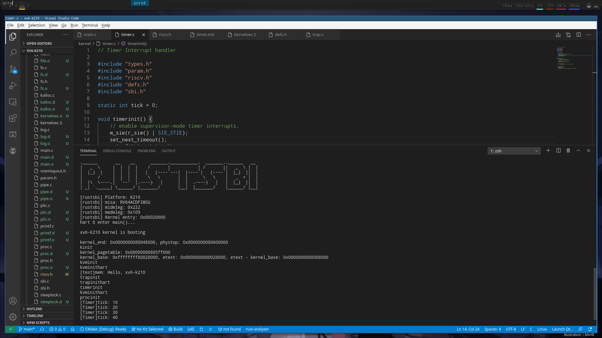

# 时钟中断移植记录
2020/10/22，将 xv6 移植到 k210 的进展：已经可以稳定接收到时钟中断了。  

## RISC-V 中的时钟中断
借鉴参考文献献 [SiFive Interrupt] 的中断分类标准，将系统中发生的能够中断当前执行代码的事件分为 3 类：  
+ Exception（异常）
+ Trap
+ Interrupt

（为了方便这里我们把后两者统称为“中断”，其实这样分类有些问题，但我不想过于纠结概念性的问题）  

而时钟中断(Timer Interrupt)属于 Interrupt 的一种。  
在 S 态中，scause 保存 Inerrupt 和 Exception 的种类。  
在 RISC-V 文档中，有一个表格记录了 scause 的值和其对应的异常或中断的种类。  
在这个表里面，我们可以看到 `Supervisor timer interrupt` 对应的 scause 最高位是 1,低位的值是 5.  

下面是几个我们移植时钟中断模块时涉及到的几个寄存器：  
+ stvec：保存 S 态中断处理函数的入口地址
+ sepc：指向发生异常或中断的那条指令的地址
+ scause：S 态中异常或者中断的原因
+ sie：中断使能寄存器

涉及到的一些指令：  
+ CSR 寄存器的读写指令
+ 一些 RISC-V 的非特权指令

## xv6 在 qemu 上的时钟中断处理
xv6 在 qemu 上运行的时候，是没有使用 SBI 实现的，它的内核直接被放在地址 0x80000000 处，qemu 直接加载它的内核代码。  
xv6 的启动过程可以看一下这个文档：[]().  
我们知道 xv6 内核启动的时候首先会进入 entry.S（一个汇编文件），然后运行其中的第一条汇编指令，然后会跳转到 start.c（一个 C 文件）里面运行，在这个文件里面的 timerinit() 函数就是在 M 态下配置初始化 xv6 时钟中断，然后进入到 S 态运行内核代码。  
我们做移植工作的时候不会很关心 xv6 在 qemu 里面是怎么实现时钟中断的，我们只需要知道一点：xv6 是在 M 态对时钟中断进行配置和初始化。  

## 使用 SBI 实现来处理时钟中断
回到 k210 板子上，我们会使用 SBI 实现，比如说 RustSBI，来为我们的内核提供与硬件交互的接口。这意味着我们的内核代码是完全运行在 S 态的，不能运行 M 态指令，这和 xv6 在 qemu 上运行不同。我们只能通过 SBI 接口来实现我们的内核。因此，和 xv6 在 qemu 上的时钟中断处理不一样，在 S 态处理时钟中断必定得是不同的做法。  
首先我们需要一个中断入口，每次中断或者异常出现时会进入到这里。这个中断入口需要先保存上下文，然后跳转到中断处理函数，返回后需要恢复上下文。xv6 的中断入口实现在 kernelvec.S 文件里面：  
```Assembly
kernelvec:
        // make room to save registers.
        addi sp, sp, -256

        // save the registers.
        sd ra, 0(sp)
        sd sp, 8(sp)
        sd gp, 16(sp)
        sd tp, 24(sp)
        sd t0, 32(sp)
        sd t1, 40(sp)
        sd t2, 48(sp)
        sd s0, 56(sp)
        sd s1, 64(sp)
        sd a0, 72(sp)
        sd a1, 80(sp)
        sd a2, 88(sp)
        sd a3, 96(sp)
        sd a4, 104(sp)
        sd a5, 112(sp)
        sd a6, 120(sp)
        sd a7, 128(sp)
        sd s2, 136(sp)
        sd s3, 144(sp)
        sd s4, 152(sp)
        sd s5, 160(sp)
        sd s6, 168(sp)
        sd s7, 176(sp)
        sd s8, 184(sp)
        sd s9, 192(sp)
        sd s10, 200(sp)
        sd s11, 208(sp)
        sd t3, 216(sp)
        sd t4, 224(sp)
        sd t5, 232(sp)
        sd t6, 240(sp)

	// call the C trap handler in trap.c
        call kerneltrap

        // restore registers.
        ld ra, 0(sp)
        ld sp, 8(sp)
        ld gp, 16(sp)
        // not this, in case we moved CPUs: ld tp, 24(sp)
        ld t0, 32(sp)
        ld t1, 40(sp)
        ld t2, 48(sp)
        ld s0, 56(sp)
        ld s1, 64(sp)
        ld a0, 72(sp)
        ld a1, 80(sp)
        ld a2, 88(sp)
        ld a3, 96(sp)
        ld a4, 104(sp)
        ld a5, 112(sp)
        ld a6, 120(sp)
        ld a7, 128(sp)
        ld s2, 136(sp)
        ld s3, 144(sp)
        ld s4, 152(sp)
        ld s5, 160(sp)
        ld s6, 168(sp)
        ld s7, 176(sp)
        ld s8, 184(sp)
        ld s9, 192(sp)
        ld s10, 200(sp)
        ld s11, 208(sp)
        ld t3, 216(sp)
        ld t4, 224(sp)
        ld t5, 232(sp)
        ld t6, 240(sp)

        addi sp, sp, 256

        // return to whatever we were doing in the kernel.
        sret
```
跳转到中断处理函数（这里是 kerneltrap 函数，在 trap.c 文件里面）后，我们需要判断中断或异常的类型，这个类型保存在 scause 里面，下面是 xv6 中类型判断函数 devintr 的实现（已经修改为 k210 版本）：  
```C
// check if it's an external interrupt or software interrupt,
// and handle it.
// returns 2 if timer interrupt,
// 1 if other device,
// 0 if not recognized.
int
devintr()
{
  uint64 scause = r_scause();

  if((scause & 0x8000000000000000L) &&
     (scause & 0xff) == 9){
    // this is a supervisor external interrupt, via PLIC.

    // irq indicates which device interrupted.
    int irq = plic_claim();

    if(irq == UART0_IRQ){
      uartintr();
    } else if(irq == VIRTIO0_IRQ){
      virtio_disk_intr();
    } else if(irq){
      printf("unexpected interrupt irq=%d\n", irq);
    }

    // the PLIC allows each device to raise at most one
    // interrupt at a time; tell the PLIC the device is
    // now allowed to interrupt again.
    if(irq)
      plic_complete(irq);

    return 1;
  } else if(scause == 0x8000000000000005L){
    // software interrupt from a supervisor-mode timer interrupt,

    if(cpuid() == 0){
      clockintr();
    }
    
    // acknowledge the software interrupt by clearing
    // the SSIP bit in sip.
    w_sip(r_sip() & ~2);里面

    return 2;
  } else {
    return 0;
  }
}
```
可以看到 scause 为 0x8000000000000005L 的时候判断为 S 态下的时钟中断，和官方文档里面描述一致。  
然后我们回到中断处理函数（kerneltrap）：  
```C
// interrupts and exceptions from kernel code go here via kernelvec,
// on whatever the current kernel stack is.
void 
kerneltrap()
{
  // printf("run in kerneltrap...\n");
  int which_dev = 0;
  uint64 sepc = r_sepc();
  uint64 sstatus = r_sstatus();
  uint64 scause = r_scause();
  
  if((sstatus & SSTATUS_SPP) == 0)
    panic("kerneltrap: not from supervisor mode");
  if(intr_get() != 0)
    panic("kerneltrap: interrupts enabled");

  if((which_dev = devintr()) == 0){
    printf("scause %p\n", scause);
    printf("sepc=%p stval=%p\n", r_sepc(), r_stval());
    panic("kerneltrap");
  }
  // printf("which_dev: %d\n", which_dev);
  
  // give up the CPU if this is a timer interrupt.
  /* if(which_dev == 2 && myproc() != 0 && myproc()->state == RUNNING) {
    supervisor_timer();
    yield();
  } */
  if(which_dev == 2) {
    // printf("[Trap]timer interrupt\n");
    timer_tick();
    if(myproc() != 0 && myproc()->state == RUNNING) {
      yield();
    }
  }
  // the yield() may have caused some traps to occur,
  // so restore trap registers for use by kernelvec.S's sepc instruction.
  w_sepc(sepc);
  w_sstatus(sstatus);
}
```
如果判断为时钟中断的话，会跳转到 timer.c 里的 timer_tick()，这个函数主要是设置下一次时钟中断的时间：  
```C
void timer_tick() {
    set_next_timeout();
    tick++;
    if((tick % 10) == 0) printf("[Timer]tick: %d\n", tick);
}
```

下面是 set_next_timeout() 函数的实现：  
```C
void
set_next_timeout() {
    // There is a very strang bug,
    // if comment the printf line below
    // the timer will not work.
    printf("");
    sbi_set_timer(r_time() + INTERVAL);
}
```

这里使用了 SBI 接口：sbi_set_timer，r_time() 向硬件读取当前的时间，然后加上一个时间间隔 INTERVAL 作为参数传给 sbi_set_timer 接口，以这种方式来处理时钟中断。  
这里需要说明一下 r_time() 函数：  
```C
// supervisor-mode cycle counter
static inline uint64
r_time()
{
  uint64 x;
  // asm volatile("csrr %0, time" : "=r" (x) );
  // this instruction will trap in SBI
  asm volatile("rdtime %0" : "=r" (x) );
  return x;
}
```
rdtime %0 这条指令会陷入到 SBI 里面，然后会返回当前的硬件时间。  
时钟中断处理完后又会回到 kernelvec.S 里面的汇编程序里面，恢复上下文，然后 sret，继续运行内核代码。  
下面补充一下 S 态中 Timer 的初始化的实现，主要是设置第一次时钟中断和开启 S 态时钟中断使能：  
```C
void timerinit() {
    // enable supervisor-mode timer interrupts.
    w_sie(r_sie() | SIE_STIE);
    set_next_timeout();
    printf("timerinit\n");
}
```
以上就是我在将 xv6 移植到 k210 上的时钟中断的实现方法。  
## 运行结果
  

## 神奇的 Bug
细心的同学可能已经发现了，在 set_next_timeout() 函数里面，我们有一行`printf`代码：  
```C
void
set_next_timeout() {
    // There is a very strang bug,
    // if comment the printf line below
    // the timer will not work.
    printf("");
    sbi_set_timer(r_time() + INTERVAL);
}
```
为什么我要加上这行`printf`呢？因为如果没有这行`printf`，时钟中断不能正常运行。更准确地来说，只有在 sbi_set_timer() 函数之前加上 printf 语句，不管是哪种格式，时钟中断才能正常工作。有兴趣的可以尝试一下。  
我的猜测是如果没有这行`printf`，编译器会把这个函数“优化掉”。因为我曾经把这个函数的签名改为`static inline void`，重新编译链接，结果就是即使没有这行`printf`时钟中断也能正常工作了。但是我 make clean 之后想重新编译的时候会报错，然后后面经过一系列改动，最终导致我没能回到当时那个运行效果了。  
我目前只能做到用`printf`打印空字符的方法来处理这个bug。  
如果有更好的解决办法，请提交 pr，非常感谢！  

