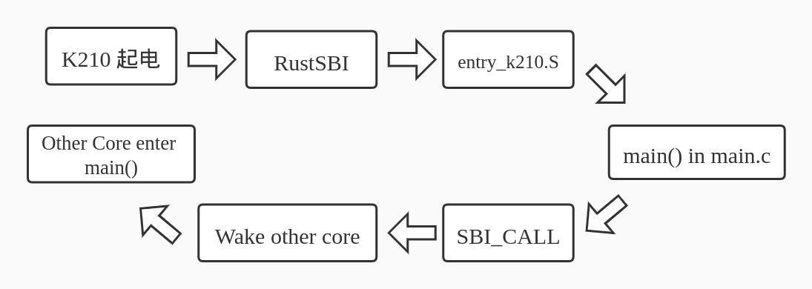
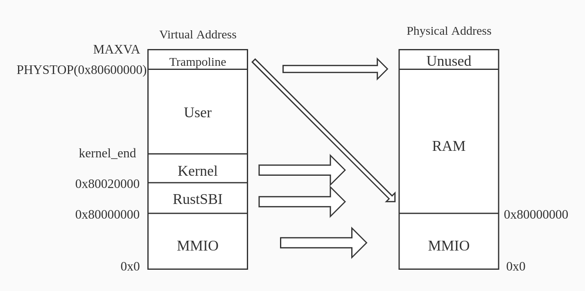
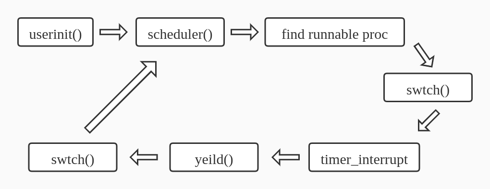

# **xv6-k210 移植报告**
+ 报告人： 车春池
+ 华中科技大学本科三年级
+ 时间： 2020-12-26  
+ 地点： 北京中科院计算所


```
 (`-')           (`-')                   <-.(`-')                            
 (OO )_.->      _(OO )                    __( OO)                            
 (_| \_)--.,--.(_/,-.\  ,--.    (`-')    '-'. ,--.  .----.   .--.   .----.   
 \  `.'  / \   \ / (_/ /  .'    ( OO).-> |  .'   / \_,-.  | /_  |  /  ..  \  
  \    .')  \   /   / .  / -.  (,------. |      /)    .' .'  |  | |  /  \  . 
  .'    \  _ \     /_)'  .-. \  `------' |  .   '   .'  /_   |  | '  \  /  ' 
 /  .'.  \ \-'\   /   \  `-' /           |  |\   \ |      |  |  |  \  `'  /  
`--'   '--'    `-'     `----'            `--' '--' `------'  `--'   `---''   
```

---
## **前言**

+ `xv6` 和 `xv6-riscv` 是 `MIT` 写的教学操作系统，在 [github](https://github.com/mit-pdos/xv6-riscv.git) 上开源
+ `xv6` 官方目前只支持 `qemu` 平台
+ `k210`：`kendryte` 产商于 2018 年发布的 `RISC-V` 双核 64 位处理器
+ `RustSBI`：华科网安同学 `洛佳` 提供的强大的 `Rust` 嵌入式项目，为移植工作提供很大帮助

---
## **移植成果**

+ 多核启动
+ 虚拟内存管理
+ 时钟中断
+ S 态外部中断
+ SD 卡驱动
+ 用户多进程

---
## **运行**
  

---
## **为什么选择 xv6**
+ 一开始想要移植 `riscv-pk` 在 k210 上跑，但研究一下其代码之后发现不可行
+ 寻找开源 OS，最好是 RISC-V 指令集，简单，并且已经能在 qemu 或者真实板子上运行的
+ 考虑过 seL4,RT-Thread 还有其他的一些开源项目
+ 最终选择 xv6-riscv，其简单，RISC-V 指令集并且已经在 qemu 上稳定运行

---
## **调研**
+ `MIT` 开源协议
+ `xv6` 复杂程度
+ 架构设计：RISC-V SBI 标准


+ 虚拟环境 vs 真实硬件环境
+ 虚拟硬盘 vs SD 卡

---
## **项目搭建**
+ `MIT` 开源协议
+ 2020-10-18
+ RISC-V 官方编译链：https://github.com/riscv/riscv-gnu-toolchain
+ 目录结构
```
xv6-k210
├── bootloader  # bootloader 的实现
├── doc # 文档
├── kernel  # 内核源码
├── linker  # 链接脚本
├── xv6-user # xv6 用户程序
├── mkfs    # 制作文件系统镜像的 .c 文件
├── tools   # 一些工具
├── target  # 目标文件
├── README.md
└── LICENSE # MIT LICENSE
```

---
## **移植工作一览**
+ 多核启动
+ 内存分配
+ 虚拟内存管理
+ 中断处理
+ S 态外部中断
+ 用户多进程
+ SD 卡驱动
+ 文件系统
+ 软硬件协同调试
+ 中文文档

---
## **K210**
+ 两个核心，双核对等，具备独立 FPU
+ 64 位处理核
+ 标称频率为 400MHZ
+ 双精度浮点处理单元
+ PLIC 支持高级中断管理
+ CLINT 支持 CPU 内置定时器中断与跨核心中断
+ 8M 的片上 SRAM
+ **S 态实现有问题**

---
## **K210 SRAM**
|模块名称|映射类型|开始地址|结束地址|空间大小|
|---|---|---|---|---|
|通用 SRAM 存储器|经 CPU 缓存|0x80000000|0x805FFFFF|0x600000|
|AI SRAM 存储器|经 CPU 缓存|0x80600000|0x807FFFFF|0x200000|
|通用 SRAM 存储器|非 CPU 缓存|0x40000000|0x405FFFFF|0x6000000|
|AI SRAM 存储器|非 CPU 缓存|0x40600000|0x407FFFFF|0x200000|

---
## **K210 VS QEMU**
+ 指令集标准版本不同，qemu 是 v1.11，k210 是 v1.9.1
+ `MMIO` 内存布局不同
+ 虚拟文件系统 vs SD 卡上的文件系统

---
## **RustSBI**
+ 脱胎于 2020 年暑假鹏城实验室的“rCore代码之夏”活动
+ 操作系统二进制接口标准（SBI 标准）的一种实现
+ Rust 语言编写
+ 模块化设计，方便支持新的平台
+ 进入国际 RISC-V SBI 实现列表，获得编号 4：  

| Implementation ID | Name                      |
|---                |---                        |
| 0                 | Berkeley Boot Loader (BBL)|
| 1                 | OpenSBI                   |
| 2                 | Xvisor                    |
| 3                 | KVM                       |
| **4**             | **RustSBI**               |
| 5                 | Diosix                    |

---
## **多核启动**
+ 内核镜像和 RustSBI 镜像并在一起使用 py 脚本烧到 k210 的 SRAM 中
+ k210 起电运行 RustSBI，然后跳转到内核入口点
+ `RustSBI` 提供接口，使得可以在启动的第 0 个核中唤醒其他核

---
## **多核启动**
  

---
## **虚拟内存管理**
+ `vm.c`
+ 维护一个内核页表 `kernel_pagetable`
+ 这个内核页表记录了 MMIO，内核空间，用户态空间， RustSBI 从虚拟地址到物理地址的映射
+ 在 void kvminithart() 里面将内核页表的首地址放到 `satp` 寄存器，然后运行 `sfence.vma` 指令

---
## **虚拟内存管理**
**但是！！ K210 采用的是 1.9 版本的 RISC-V 标准，不存在 sfence.vma 这条指令，只有旧版指令 sfence.vm**  
怎么办？求助 `RustSBI`

---
## **虚拟内存管理**
**RustSBI 如何解决这个问题？**  
+ `sfence.vma` 作为异常指令被 `RustSBI` 捕获
+ 读取 `satp`（读取 `ppn`）
+ 根据第二步读取的值写 `sptbr` （v1.9 指令集版本使用的寄存器，相当于 `satp`）设置页表
+ 设置 `mstatus` 中相应的位开启分页（内核无法做这个工作）
+ 运行旧版指令 `sfence.vm` 清空 `TLB`
+ 写 `mepc` 并返回到 `sfence.vma` 的下一条指令去运行（`mepc + 4`）

---
## **虚拟内存管理**
<!--    -->


---
## **时钟中断**
**通过 RustSBI 设置时钟中断**
+ `timer.c` 
+ 参考 `rCore` 实现
+ 通过 SBI 调用实现
    ```
    static inline void sbi_set_timer(uint64 stime_value)
    {
	    SBI_CALL_1(SBI_SET_TIMER, stime_value);
    }
    ```
+ 神奇的 bug：set_next_timeout 中的 printf("");

---
## **S 态外部中断**
以下参考吴一凡学长的文档，如有雷同，纯属照搬。  
为什么需要移植 S 态外部中断？  
+ **RustSBI 运行在 M 态，OS 内核运行在 S 态**
+ **想要使用 S 态众多的数据结构来对外部中断进行处理**  

移植 S 态外部中断遇到的问题：`k210` 上没有 S 态外部中断！  
怎么办？  
**求助 RustSBI**  

---
## **S 态外部中断**
**RustSBI 使用黑科技解决 K210 上 S 态外部中断**
感谢吴一凡学长移植 `rCore` 到 `k210` 上的文档和洛佳同学的解惑。  
不敢班门弄斧，只说一下步骤：  
+ `RustSBI` 提供一个接口  
```Rust
match cause {
        Trap::Exception(Exception::SupervisorEnvCall) => {
            if trap_frame.a7 == 0x0A000004 && trap_frame.a6 == 0x210 {
                // We use implementation specific sbi_rustsbi_k210_sext function (extension 
                // id: 0x0A000004, function id: 0x210) to register S-level interrupt handler
                // for K210 chip only. This chip uses 1.9.1 version of privileged spec,
                // which did not declare any S-level external interrupts. 
                ...
            } else {
                ...
        }}}
```
+ S 态外部中断处理函数 `supervisor_external_handler`
+ 将这个函数指针作为参数调用 `RustSBI` 提供的接口
+ 外部中断将会在 `supervisor_external_handler` 中处理

---
## **用户多进程**
  

---
## **SD 卡驱动**
+ `sdcard.c`
+ 官方 SDK demo 实现了读取 sd 卡的例程
+ 暴力出奇迹，移植官方 SDK 到内核中
+ 问题：官方 SDK 编译链不同，代码太多，依赖关系复杂
+ 和很多外设打交道，比如 GPIO，FPIO 等等，还需要调整时钟信号
+ 最终将官方 SDK 部分模块移植到了内核中，成功通过 SD 卡读取测试
+ SD 卡读写还不稳定
+ C 开发环境缺乏包管理工具

---
## **文件系统**
+ 由于 SD 卡读写不稳定的问题还没解决，还没完成
+ xv6 文件系统 or Fat32 文件系统 or 全都要

---
## **软硬协同调试**
+ 硬件调试非常非常麻烦，希望有软件调试环境
+ `Makefile` + 条件编译
+ `make run [platform=xxx]`
+ 类似于封装硬件抽象层
+ `RustSBI` 基本上处理了大部分平台无关性
+ 软件调试，一键部署

---
## **依赖于 RustSBI 的模块**
- [x] 多核启动
- [ ] 内存分配
- [x] 虚拟内存管理（`sfence.vma` 指令）
- [x] 时钟中断
- [x] S 态外部中断（其实有 bug 还没修）
- [ ] 用户多进程
- [x] SD 卡驱动
- [x] 文件系统
- [x] 平台无关性

---
## **中文文档**
+ 移植文档
+ `xv6-riscv` 原理文档

---
## **致谢**
+ 感谢比赛方和陈渝老师提供这次演讲机会，并且感谢邵志远老师一直以来对我的支持
+ `xv6-k210` 项目得到了很多同学的支持，特别是华科 18 级计卓班的刘一鸣和陆思彤同学，进程管理这部分的调试工作大部分是他们在做
+ 感谢 `RustSBI` 项目
+ 感谢 `rCore-Tutorial` 项目和今年暑假在鹏城实验室的`代码之夏`活动，让我踏入了 `Rust` 语言和体系结构的大门
+ 感谢洛佳同学和吴一凡学长技术上的帮助

---

## **谢谢各位**
华中科技大学  
计算机科学与技术学院  
校交 1801 班
车春池    
