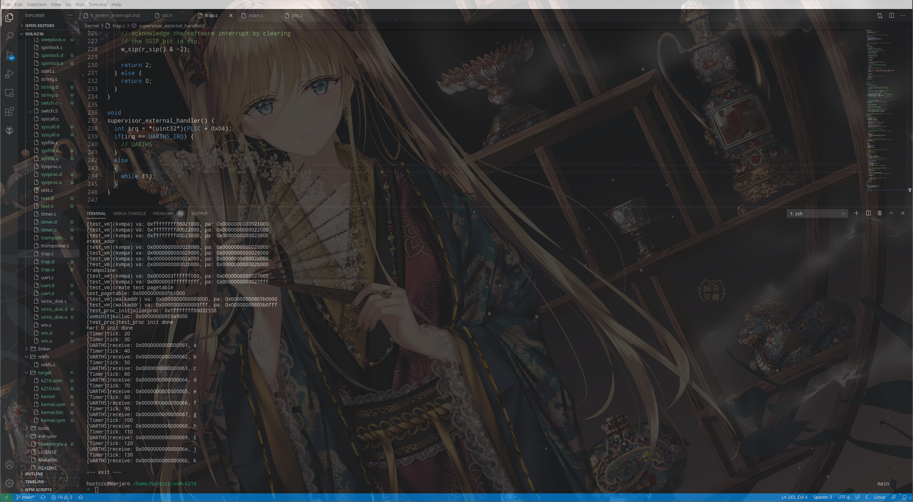

# S 态外部中断移植记录

## 什么是外部中断
RISC-V 有三种标准的中断源：软件、时钟和外部来源。软件中断通过向内存映射寄存器中存
数来触发，并通常用于由一个 hart 中断另一个 hart（在其他架构中称为处理器间中断机
制）。当实时计数器 mtime 大于 hart 的时间比较器（一个名为 mtimecmp 的内存映射寄存
器）时，会触发时钟中断。外部中断由平台级中断控制器（大多数外部设备连接到这个中
断控制器）引发。不同的硬件平台具有不同的内存映射并且需要中断控制器的不同特性，
因此用于发出和消除这些中断的机制因平台而异。所有 RISC-V 系统的共同问题是如何处
理异常和屏蔽中断，这个在本文档中不多加叙述。  

## RISC-V 中断
RISC-V 中的中断分四种：  
+ 软件中断（Software Interrupt）
+ 时钟中断（Timer Interrupt）
+ 外部中断（Extern Interrupt）
+ 本地中断（Local Interrupt）

在 RISC-V 中有两个中断控制器：  
+ PLIC：负责转发外部中断
+ CLINT：负责生成并转发软件，时钟中断

中断代理：  
+ RISC-V 存在 M 态中断代理寄存器`mideleg`，还有 M 态异常代理寄存器`medeleg`
+ 所有的中断/异常默认均在 M 态处理，除非设置`mideleg/medeleg`寄存器
+ 中断与异常不同的地方在于各类中断均分成 M/S/U Mode，而异常与特权级无关
+ 通过设置`mideleg`可以将 S/U Mode 中断处理代理到 S Mode 处理
+ 通过设置`sideleg`可以将 U Mode 中断处理代理到 U Mode 处理
+ 一个 X Mode 中断不会被代理到特权级低于 X 的 Mode 上处理

结合中断和特权级，中断处理的完整过程如下：  
+ 假设在处于 X Mode 的 hart 上接收到 Y Mode 中断，首先决定是否处理。若 Y 优先级高于 X，则发生抢占，必定处理;若 Y 优先级低于 X，则此中断被屏蔽，不进行处理;若 Y 优先级与 X 相同，需要`xstatus, xie`相关使能打开，才进行处理。  
+ 如果要进行处理，则依次查看中断代理寄存器`mideleg/sideleg`，决定到哪个特权级处理该中断。  

软件代理和硬件代理：  
+ 刚才提到的通过设置`mideleg/sideleg`，在中断到来时硬件自动将中断代理到相应的特权级处理，称为硬件代理
+ 与之对应，在中断到来时，不经过硬件代理，而在中断处理函数中以软件的手段将中断转发到其他特权级处理，则可称为软件代理
+ OpenSBI 的时钟中断处理是一个比较典型的例子，详细的在这里不做介绍。  

串口中断：  
+ 串口中断属于外部中断
+ k210 上 S 态外部中断不存在
+ S 态软中断可以受到，只需要设置 SSIP 标志位

## K210 外部中断
移植过程中遇到的问题就是：K210 没有 S 态外部中断！  

## 在 S 态处理 K210 外部中断
动机：首先我们的 OS 内核跑在 S 态，在 S 态中我们可以使用虚拟地址，我们有一些数据结构和函数帮我们处理中断。其次在我们的层级结构中，SBI 是完全跑在 M 态的，如果我们要处理 M 态外部中断，就要去到 SBI 里面实现代码。这对于不熟悉 SBI 的内核开发者来说是不友好的。  
参考 luojia 和清华吴一凡学长的探索成果，我们将会使用一种黒科技来实现 K210 中的 S 态外部中断：  
+ 首先我们在 RustSBI 里面开个洞，注册一个 SBI 调用函数，调用号为 0x9
+ 然后我们在 S 态中写一个外部中断处理函数，然后将这个函数指针作为参数来调用上述的 SBI 调用

就像这样：  
```C
// SBI 调用，调用号为 0x09
static inline void sbi_set_extern_interrupt(unsigned long func_pointer) {
	SBI_CALL_1(0x09, func_pointer);
}

...

// S 态外部中断处理函数
void
supervisor_external_handler() {
  int irq = *(uint32*)(PLIC + 0x04);
  if(irq == UARTHS_IRQ) { // 如果是键盘输入
    // UARTHS
  }
  else  // 否则卡死
  {
    while (1);
  }
}

...

// 使用 SBI 调用注册 S 态外部中断处理函数
sbi_set_extern_interrupt((uint64)supervisor_external_handler);
```

这样做看起来很简单，是因为 luojia 在 RustSBI 中针对 K210 这个平台做的特定的功能，如果是 OpenSBI 就达不到这种效果。这么做的原理我这里直接引用吴一凡学长的笔记：  
```Markdown
在洛佳的提醒之下想到可以通过设置 mstatus.mprv 来在 M 特权级收到外部中断的时候调用 S 特权级编写的处理函数 devintr，这样无需手动查页表就能访问 S 特权级的数据结构，且 K210 和 qemu 两个平台之间的差别比较小。只需在 k210 平台上引入一个新的 sbi_call 将 devintr 入口点传给 M 特权级的 RustSBI 即可。
```
更多的细节可以移步吴一凡学长的移植记录：[吴一凡-彻底解决k210外部中断](https://github.com/wyfcyx/osnotes/blob/master/book/%E5%BD%BB%E5%BA%95%E8%A7%A3%E5%86%B3k210%E5%A4%96%E9%83%A8%E4%B8%AD%E6%96%AD.md)  

## 运行结果
目前该项目的外部中断是这样处理的：  
+ 首先按照前面说的那样在 RustSBI 中注册中断处理函数
+ 然后在这个中断处理函数里面对中断源进行判断，对于特定的中断源，我们什么也不做，对于其他中断源，我们进入一个死循环，表明我们受到了一个除键盘中断以外的外部中断
+ 如果是键盘外部中断的话，我们输入的字符会在放在内存中的一个缓冲区里面，我们每次读取这个缓冲区就会取到一个字符，然后我们下次读这个缓冲区的时候就会读下一个字符，如果缓冲区为空，我们将会读取到一个很大的数据
+ 每 10 次时钟中断的时候，我们就从缓冲区里面读一个字符，如果之前键盘有输入，那么我们就将它打印出来，像下面这样：  
```C
void timer_tick() {
    set_next_timeout();
    tick++;
    if((tick % 10) == 0) {
        printf("[Timer]tick: %d\n", tick);
        uint32 c = *(uint32*)(UARTHS + UARTHS_REG_RXFIFO);
        if(c <= 255) {
            printf("[UARTHS]receive: %p, ", c);
            sbi_console_putchar(c);
            printf("\n");
        }
    }
}
```

运行结果如下：  
  

## 鸣谢
本文档参考了清华吴一凡学长的笔记，另外这次移植基本上都是采用了吴一凡学长和洛佳的成果，正所谓前人栽树，后人乘凉。  
如果本文档有错，可以联系作者邮箱：linuxgnulover@gmail.com .  

