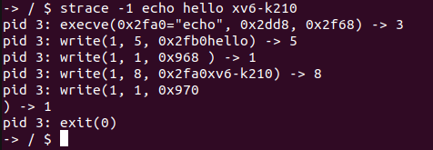
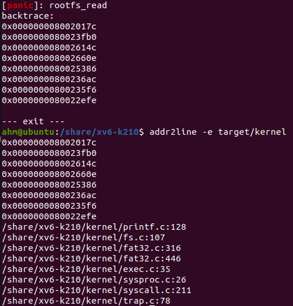

# 调试指南
retrhelo <artyomliu@foxmail.com>

## 关于`debug.h`
在最近的commit中，加入了`kernel/include/debug.h`并修改了`Makefile`以便于更好的对内核进行调试。在修改后，可以通过指定模块的方式，启动代码中特定的调试代码。而为了达到这一效果，在编写代码时需要遵循特定的规范。下文将详细解释这些规范。

而在`debug.h`中，加入了如下的宏用于调试

* `__INFO(str)`：用于将`str`转换为绿色字体输出
* `__WARN(str)`：用于将`str`转换为黄色字体输出
* `__ERROR(str)`：用于将`str`转换为红色字体输出
* `__debug_info(module, ...)`：在调试模式下输出一段info信息，用于标识正常的调试信息
* `__debug_warn(module, ...)`：在调试模式下输出一段警告信息，用于表示那些不合预期但不影响运行的错误
* `__debug_error(module, ...)`：在调试模式下输出一段错误信息，用于表示那些会影响到内核运行的严重错误

### Makefile的使用
修改后的Makefile可以通过如下的`make`命令使用
> make [platform=qemu|k210] [mode=release|debug] [module=\*]
* platform: 指定编译的目标平台
* mode: 指定编译的目标模式，指定为**debug**以进入debug模式
* module: 指定所需要调试的模块，模块名与C语言源文件的名称相同，不同模块之间使用空格分开

在**debug**中指定模块将能够在编译时加入`__DEBUG_module`（*module*为所调试的模块名）宏。在编写代码中能够判断当前代码是否需要被调试。

### 如何编写模块代码
以内核中的动态内存分配代码为例。在`kernel/kmalloc.c`的最开始的部分，加入了这样的代码
```C
#ifndef __DEBUG_kmalloc
#undef DEBUG
#endif 
```
通过判断`__DEBUG_module`是否被定义来决定是否对当前模块进行调试。

对于很多模块而言，在调试时会编写其对应的测试程序。在模块外的某些地方，则会希望调用这些调试程序。显然，在发布release版本时，我们希望能够去掉对这些调试程序的调用。在`kernel/include/kmalloc.h`是这样做的
```C
#ifdef __DEBUG_kmalloc 
	void kmtest(void);
	#define __debug_kmtest() \
		do {kmtest();} while (0)
#else 
	#define __debug_kmtest() \
		do {} while (0)
#endif 
```
这样在任何模式下，宏`__debug_kmtest()`总是可用的。而只有当`DEBUG`（如果看过`Makeilf`的代码就会知道，当`__DEBUG_kmalloc`被定义时，`DEBUG`必然被定义）和`__DEBUG_kmalloc`两个宏同时被给出时，才会将`__debug_kmtest()`变为有效的代码。

## 其他有助于调试的信息

### strace 程序

这是一个可以追踪系统调用的命令，实际上也是 xv6-lab 中的一个任务，不过我们为其添加了参数追踪的功能。
使用方式如下。
```bash
$ strace MASK PROGRAM [PROGRAM-ARGS]
```
其中 `MASK` 为系统调用号的二进制位串。例如，要追踪 1 号和 3 号系统调用，则 `MASK` 为 5 (101b)。
当然，最简单的方式是直接令其为 -1 (...1111b)。但受限于 64 位字长，这种参数方式不能追踪系统调用号超过 64 的情况。
一个简单的例子如下，追踪 `echo` 程序请求的系统调用。

  

### backtrace 信息

在内核出现 `panic` 时，会打印出一系列地址值，即内核中的函数调用栈。可以通过 `addr2line` 命令，
将这些地址值转换为 c 文件中的代码位置。
```bash
$ addr2line -e target/kernel
```
然后将 `panic` 打印出的一系列地址全部复制粘贴即可，如下图所示。

  

这实际上也是 xv6-lab 中的一个任务。